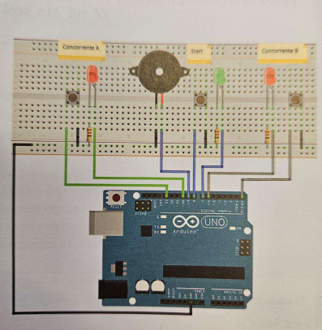

# Reflex test arduino

### immagine del circuito

## descrizione

Collegare tutte le componenti richieste nella immagine, copiare il codice, e una volta eseguito cliccare il bottone al centro dove è presente il led verde, dopodichè, dopo un tempo breve il buzzer eseguirà un suono, qualora uno dei due concorrenti clicca il bottone per primo vince.